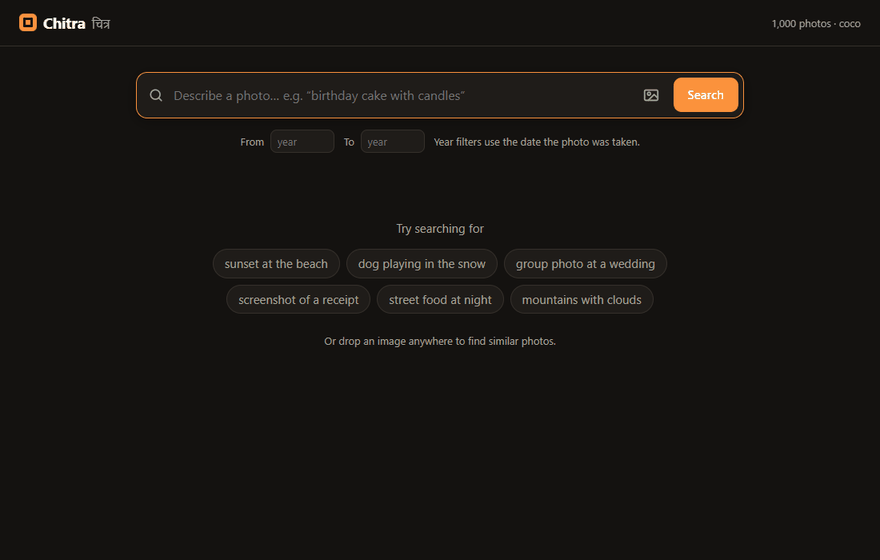
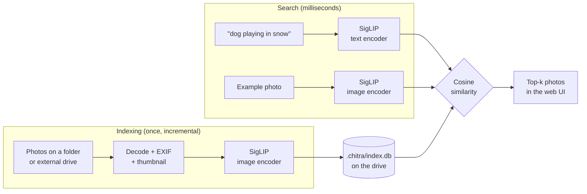

<p align="center">
  
</p>

<p align="center">
  <a href="https://github.com/KruthiVaranasi/chitra/actions/workflows/ci.yml"></a>
  
  
  
  
</p>

# Chitra <sub>चित्र</sub>

**Search your photos by describing them. Offline, on any folder or drive.**

Type *"kids on a beach at sunset"* or *"screenshot of a train ticket"* and Chitra finds the matching photos across tens of thousands of files. You don't need tags, albums or folder names. Everything runs on your own machine, and nothing is uploaded.

<p align="center">
  
  <br><sub>The real app searching 1,000 photos on a laptop CPU: text search → open a photo → "Find similar".</sub>
</p>

## Why

Photos pile up on laptops, external hard disks and old backup SSDs. Finding one picture usually means remembering *when* it was taken and scrolling through folders. Cloud photo apps can search by content, but only for photos you upload to them.

Chitra brings that kind of search to your local files and drives:

- **Natural-language search.** Describe what's in the photo.
- **Search by example.** Drop in an image (or a phone snap of a printed photo) to find the original and similar shots.
- **The index lives on the drive.** Indexing an external disk stores the index in a hidden `.chitra/` folder on that disk. Plug it into any computer and it's searchable at once, even if it mounts as `E:` today and `F:` tomorrow.
- **Incremental and resumable.** Re-running only processes new or changed files. Stop at any time and it picks up where it left off.
- **Private by design.** It uses open models from Hugging Face, runs locally on CPU (GPU if available), and the server only listens on `127.0.0.1`.

## Quick start

Requires Python 3.10+.

```bash
git clone https://github.com/KruthiVaranasi/chitra.git
cd chitra
python -m venv .venv
# Windows: .venv\Scripts\activate     macOS/Linux: source .venv/bin/activate
pip install -e ".[heic]"
```

> On machines without an NVIDIA GPU, install the smaller CPU build of PyTorch first:
> `pip install torch --index-url https://download.pytorch.org/whl/cpu`

```bash
chitra index "D:\Photos"          # first run downloads the model (~800 MB, once)
chitra serve "D:\Photos"          # opens the search UI in your browser
```

Or search straight from the terminal:

```bash
chitra search "D:\Photos" "birthday cake with candles" -k 5
chitra search "D:\Photos" --image old_print_scan.jpg
chitra search "D:\Photos" "beach" --year-from 2021 --year-to 2022
chitra stats  "D:\Photos"
```

## How it works



Chitra uses [SigLIP](https://huggingface.co/google/siglip-base-patch16-224) (Apache-2.0), a vision-language model that places images and text in **the same vector space**. A photo and a sentence describing it end up close together, so search becomes nearest-neighbour lookup. Exact brute-force search with NumPy compares a query against 100k photos in a few milliseconds; most of the ~200 ms per search is encoding the query text on CPU.

| Component | Choice |
|---|---|
| Model | `google/siglip-base-patch16-224` (any CLIP/SigLIP model on HF works via `--model`) |
| Index | SQLite: relative paths, EXIF date, dimensions, float32 embeddings |
| Thumbnails | 320 px JPEGs in `.chitra/thumbs/` |
| Speed tricks | JPEG draft-mode decoding, threaded image loading overlapped with model inference |
| Server | FastAPI + vanilla JS, no build step |
| Formats | JPEG, PNG, WebP, BMP, GIF, TIFF, HEIC/HEIF (with `[heic]`) |

### Other models

```bash
chitra index "D:\Photos" --model openai/clip-vit-base-patch32 --rebuild   # faster, slightly less accurate
chitra index "D:\Photos" --model google/siglip-large-patch16-384 --rebuild # slower, more accurate
```

## Benchmark

Text-to-image retrieval on the standard **COCO Karpathy test split**: 1,000 photos, each with 5 human-written captions. Every caption (5,001 in total) is used as a search query, and we check where the correct photo ranks.

| Metric | Result |
|---|---|
| **Recall@1** (correct photo is the #1 result) | **67.8%** |
| **Recall@5** | **89.9%** |
| **Recall@10** | **95.1%** |
| Median rank of the correct photo | **#1** of 1,000 |
| Search latency, end to end (laptop CPU) | ~220 ms |
| Indexing speed (laptop CPU, no GPU) | ~3.6 photos/sec |

Real libraries are easier than this test in one way and harder in another. Queries like "beach" have many correct answers, which makes them easier, but libraries are much larger than 1,000 photos. Reproduce with:

```bash
python benchmarks/coco_benchmark.py --n 1000
```

## Project layout

```
chitra/
  scanner.py   walk folders, skip system dirs
  imaging.py   decode, EXIF dates, thumbnails, HEIC
  model.py     Hugging Face embedder (SigLIP/CLIP)
  store.py     on-drive SQLite index
  indexer.py   incremental, resumable indexing
  search.py    text / image / similar search with date filters
  server.py    local API + UI
  cli.py       `chitra` command
tests/         run without downloading a model (fake embedder)
benchmarks/    COCO retrieval benchmark + latest results.json
docs/          README banner and demo GIF
```

## Development

```bash
pip install -e ".[dev]"
pytest
```

## Roadmap

- [x] Text search, image search, find similar, year filters
- [x] On-drive, incremental, resumable index
- [x] Local web UI
- [ ] **Search across multiple drives**, including drives that aren't plugged in ("it's on *Backup-2019*, folder X")
- [ ] Auto-index when a drive is connected
- [x] Retrieval benchmark (COCO recall@K)
- [ ] User study: time-to-find versus manual folder browsing
- [ ] Multilingual queries (Hindi and other Indian languages)
- [ ] Video search (sampled frames), OCR for screenshots and documents
- [ ] One-click Windows installer

## License

MIT. Demo and benchmark photos come from the [COCO dataset](https://cocodataset.org) (images under their original Flickr Creative Commons licenses).
